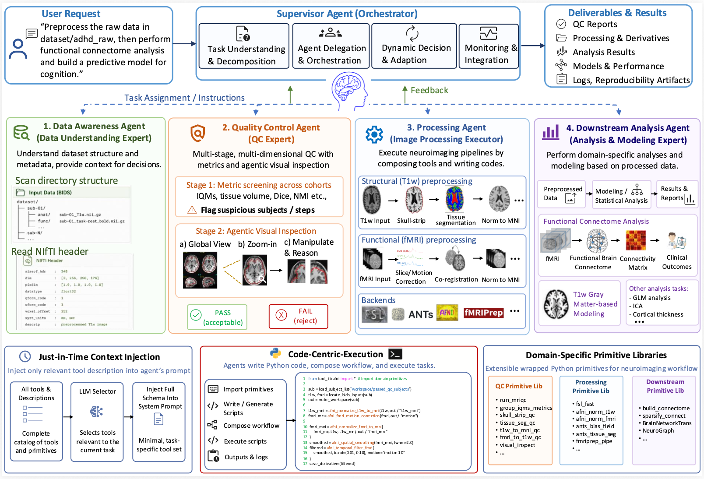

# Towards a Virtual Neuroscientist: Autonomous Neuroimaging Analysis via Multi-Agent Collaboration (NEXUS)



NEXUS is a multi-agent **AI Neuroscientist** system that automates end-to-end neuroimaging research workflows — from raw MRI data inspection, preprocessing, and quality control all the way through downstream predictive modeling. It and orchestrates a **Supervisor Agent** together with four specialized sub-agents that wrap standard neuroimaging toolboxes (FSL, AFNI, ANTs, fMRIPrep, FreeSurfer, MRIQC, etc.).

---

## Table of Contents
- [System Overview](#system-overview)
- [Architecture](#architecture)
- [Repository Structure](#repository-structure)
- [Installation](#installation)
- [Configuration](#configuration)
- [Usage](#usage)
- [Supported Tools](#supported-tools)
- [Knowledge Base](#knowledge-base)
- [Example Tasks](#example-tasks)

---

## System Overview

Designing a complete neuroimaging analysis pipeline traditionally requires expertise across several domains: BIDS data wrangling, preprocessing software (FSL/AFNI/ANTs/fMRIPrep), visual quality control, atlas-based feature extraction, and downstream statistical or machine-learning modeling. NEXUS encapsulates this expertise into cooperating LLM agents, each responsible for a well-defined stage of the workflow.

A user submits a high-level natural-language request (e.g., *"Preprocess these ADHD200 subjects and train a classifier for ADHD diagnosis"*). The Supervisor Agent decomposes the request into sub-tasks, dispatches them to the appropriate specialist agents, and iteratively coordinates between them — adjusting the pipeline based on quality-control feedback, re-running steps when needed, and finally producing trained models with reproducible inference scripts.

---

## Architecture

NEXUS follows a **supervisor / sub-agent** topology.

### Supervisor Agent (`source/master_control_agent.py`)
The supervisor / "brain" of the system. Responsible for:
- Task decomposition and high-level planning
- Routing instructions to the correct sub-agent
- Collecting feedback and dynamically adjusting the pipeline

### Data Awareness Agent (`source/data_awareness_agent.py`)
A neuroimaging data profiling expert. Inspects directory structure, BIDS metadata, NIfTI/DICOM headers, and `participants.tsv` files. Returns data inspection summaries to the supervisor.

### Processing Agent (`source/processing_agent.py`)
Executes neuroimaging preprocessing. Handles both **structural MRI (sMRI)** and **functional MRI (fMRI)** through tools wrapping FSL, AFNI, ANTs, fMRIPrep, FreeSurfer, and MRIQC. Uses prompt-based **tool retrieval** so only the relevant tools are loaded into the agent's context for any given task.

### Quality Control Agent (`source/quality_control_agent.py`)
Performs binary (pass/fail) quality assessment of:
- Raw MRI data (via MRIQC and related metrics)
- Skull stripping outputs
- Tissue segmentation outputs
- T1w → MNI normalization
- fMRI → anatomical co-registration
- fMRI → MNI normalization


### Downstream Analysis Agent (`source/downstream_analysis_agent.py`)
Builds and trains predictive models on top of preprocessed data. Currently supports:
- **Functional brain connectome analysis** (atlas-based connectivity, classical ML, and deep models such as BNT)
- **VBM-based classification** using gray matter probability maps (e.g., for AD prediction)

Knowledge documents in `source/knowledge_base/downstream_analysis/` provide methodological guidance the agent can retrieve at run time.

---

## Repository Structure

```
NEXUS/
└── source/
    ├── master_control_agent.py          # Supervisor agent + entry point
    ├── data_awareness_agent.py          # Data profiling sub-agent
    ├── processing_agent.py              # MRI preprocessing sub-agent
    ├── quality_control_agent.py         # QC sub-agent
    ├── downstream_analysis_agent.py     # Modeling sub-agent
    │
    ├── knowledge_base/
    │   └── downstream_analysis/
    │       ├── brain_connectome_analysis_guide.md
    │       └── GM_ProbabilityMap_AD_Prediction.md
    │
    └── tool_lib/
        ├── __init__.py                  
        │
        │   # Preprocessing tool wrappers
        ├── fsl.py
        ├── afni.py
        ├── ants.py
        ├── fmriprep.py
        ├── freesurfer.py
        ├── parallel_mriqc.py
        ├── prepare.py
        ├── others.py
        ├── processing_execution.py      # Tools exposed to the Processing Agent
        │
        │   # Other agent toolsets
        ├── data_awareness.py             # Tools for the Data Awareness Agent
        ├── quality_control.py            # Tools for the QC Agent
        ├── quality_control_lib.py        # Underlying QC algorithms
        ├── downstream_analysis.py        # Tools for the Downstream Agent
        ├── brain_connectome_analysis.py  # Connectome modeling utilities
        │
        │   # Tool descriptions used for retrieval
        ├── processing_code_description/
        │   ├── fsl_descriptions.py
        │   ├── afni_descriptions.py
        │   ├── ants_descriptions.py
        │   └── fmriprep_descriptions.py
        ├── quality_control_description/
        │   ├── before_process_qc.py
        │   └── after_process_qc.py
        ├── downstream_code_description/
        │   └── brain_connectome_analysis.py
        │
        │   # Visual few-shot examples for QC
        ├── qc_fewshot_examples/
        │   ├── post_t1w_skullstrip/
        │   ├── post_t1w_tissueseg/
        │   ├── post_t1w_normalize_mni/
        │   └── post_fmri_to_t1w_or_mni/
        │
        │   # Brain Network Transformer components
        └── bnt_comp/
            ├── components/transformer_encoder.py
            └── ptdec/{cluster.py, dec.py}
```

---

## Installation

### Prerequisites

NEXUS calls real neuroimaging software via subprocess. The following must be installed and available on `PATH` before running:

| Tool       | Used by                                                  |
|------------|----------------------------------------------------------|
| FSL        | `fsl.py` — BET, FAST, FLIRT, FNIRT, MCFLIRT, fslmaths    |
| AFNI       | `afni.py` — 3dSkullStrip, 3dSeg, @SSwarper, 3dvolreg, …  |
| ANTs       | `ants.py` — N4BiasFieldCorrection, antsRegistrationSyN…  |
| fMRIPrep   | `fmriprep.py`                                            |
| FreeSurfer | `freesurfer.py`                                          |
| MRIQC      | `parallel_mriqc.py`                                      |

Container-based installations (Docker / Singularity / Apptainer) are recommended for fMRIPrep and MRIQC.

### Python environment

```bash
git clone <this-repository>
cd NEXUS

python -m venv .venv
source .venv/bin/activate

pip install \
    langgraph \
    langchain \
    langchain-openai \
    langchain-community \
    pydantic \
    python-dotenv \
    nibabel \
    numpy \
    pandas \
    scikit-learn \
    torch
```
---

## Configuration

Create a `.env` file in the project root with your LLM credentials:

```bash
OPENAI_API_KEY=sk-...
```

The default model is set in `master_control_agent.py` and the sub-agents (e.g., `model="gpt-5.2"`). Edit the `ChatOpenAI(...)` calls to switch to another model.

NEXUS uses a single shared workspace for intermediate outputs:

```
Path/temp_workspace/
```

You can configure where this workspace lives by editing the corresponding paths in the agents' system prompts and tool wrappers.

---

## Usage

The Supervisor Agent is the entry point.

```bash
cd source
python master_control_agent.py
```

The `__main__` block of `master_control_agent.py` contains example user requests for:
- **ADHD200** — fMRI preprocessing + functional connectome classification (Control vs. ADHD)
- **ADNI** — sMRI preprocessing + VBM-based classification (CN vs. AD)

Edit `user_request` inside `master_control_agent.py` to run your own task. A typical request specifies:
1. The location of the raw data
2. The target label and where to find it (e.g., `participants.tsv`)
3. The expected deliverables (preprocessing pipeline, trained model, inference script)

During a run, the supervisor streams updates to stdout:

```
*****[Supervisor Agent]*****
... thinking & tool calls ...

################################################################################
#                  >>> ENTERING PROCESSING AGENT <<<                           #
################################################################################
```

When finished, NEXUS prints a per-agent token-usage and cost summary.

---

## Supported Tools

### Structural MRI (sMRI)
| Step                       | FSL                              | AFNI                            | ANTs                                |
|----------------------------|----------------------------------|---------------------------------|-------------------------------------|
| Skull stripping            | `fsl_bet_t1w`                    | `afni_t1w_skull_strip`          | `ants_skull_strip`                  |
| Bias field correction      | —                                | —                               | `ants_bias_field_correction`        |
| Tissue segmentation        | `fsl_fast`                       | `afni_tissue_segmentation`      | `ants_tissue_segmentation`          |
| T1w → MNI normalization    | `fsl_normalize_t1w_to_mni`       | `afni_normalize_t1w_to_mni`     | `ants_normalize_to_mni_template`    |
| Warp GM probability map    | `fsl_warp_gm_tissue_seg_to_mni`  | `afni_warp_gm_tissue_seg_to_mni`| `ants_warp_gm_tissue_seg_to_mni`    |

### Functional MRI (fMRI)
| Step                       | FSL                              | AFNI                                    |
|----------------------------|----------------------------------|-----------------------------------------|
| Slice-timing correction    | `fsl_slicetimer`                 | `afni_fmri_slice_timing_correction`     |
| Motion correction          | `fsl_motion_correct` (MCFLIRT)   | `afni_fmri_motion_correction` (3dvolreg)|
| Co-registration to T1w     | `fsl_coregister_func_to_anat`    | `afni_coregister_fmri_to_anat`          |
| Normalization to MNI       | `fsl_normalize_func_to_mni`      | `afni_normalize_fmri_to_mni`            |
| Spatial smoothing          | `fsl_spatial_smooth`             | `afni_spatial_smoothing`                |
| Temporal filtering         | `fsl_temporal_filter`            | `afni_temporal_filter_fmri`             |

Additional pipelines: `fmriprep.py` (full fMRIPrep), `freesurfer.py` (recon-all), `parallel_mriqc.py` (parallel MRIQC).

### Quality Control
- Pre-processing QC: header consistency checks, MRIQC-based metrics
- Post-processing QC: skull-stripping mask review, tissue-segmentation review, T1w-to-MNI alignment, fMRI-to-T1w / fMRI-to-MNI alignment
- Visual QC is augmented with **few-shot examples** (acceptable vs. rejected) under `tool_lib/qc_fewshot_examples/`.

### Downstream Analysis
- Atlas-based functional connectome construction (AAL, Schaefer200, HCP360, etc.)
- Deep models — Brain Network Transformer (`tool_lib/bnt_comp/`)
- VBM-based classification using gray-matter probability maps

---

## Knowledge Base

The Downstream Analysis Agent retrieves methodological guidance at run time:

- `knowledge_base/downstream_analysis/brain_connectome_analysis_guide.md` — Brain connectome analysis guidance.
- `knowledge_base/downstream_analysis/GM_ProbabilityMap_AD_Prediction.md` — VBM-based AD-prediction guidance.

To extend NEXUS's capabilities, add a new `.md` file in this folder with a top-level `# Title` and an *Overview* section. The Downstream Agent's resource discovery will pick it up automatically.

---

## Example Tasks

Two example user requests are provided in `master_control_agent.py`:

### 1. ADHD200 — Functional connectome classification
> *Preprocess raw ADHD200 subjects and train a classification model that predicts diagnosis (Control vs. ADHD) from resting-state functional connectivity. Deliverables: preprocessing pipeline, trained model, and an inference script that runs on a held-out test set.*

### 2. ADNI — VBM-based AD classification
> *Preprocess raw ADNI sMRI subjects with VBM and train a classifier that predicts diagnosis (CN vs. AD) from voxel-wise gray-matter probability maps.*

Both tasks are framed as **competitive evaluations** with a hidden test set.